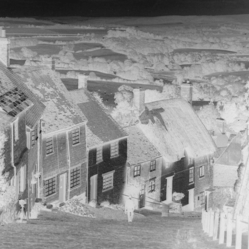
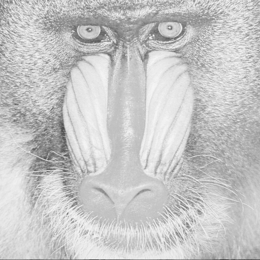
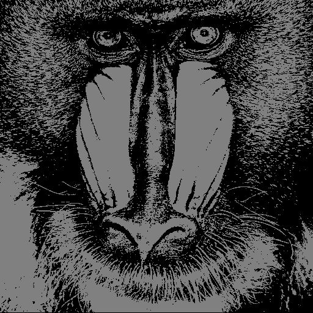
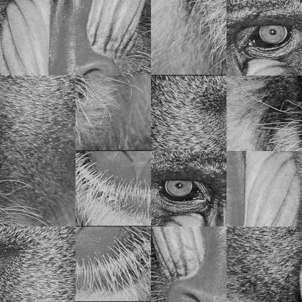
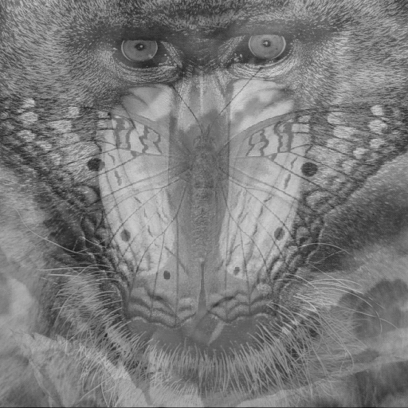
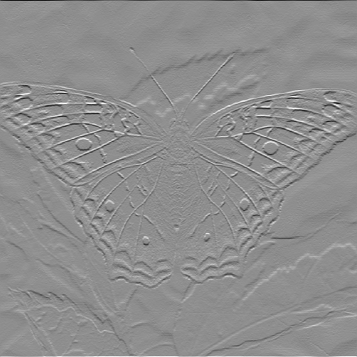

# Introdução ao Processamento de Imagem Digital

Este repositório é referente a matéria **Introdução ao Processamento de Imagem Digital**
(MO443/MC920) que foi oferecida no 2º semestre de 2022 pelo professor [Hélio Pedrini](https://www.ic.unicamp.br/~helio/)
do instituto de computação (IC) da Unicamp.

O conteúdo do repositório é separado em 3 pastas estruturadas da seguinte forma

## Aulas

Este diretório contém os _slides_ das aulas ao longo do semestre

## Listas Provas

Este repositório contém arquivos _jupyter notebook_ que contém uma introdução à vetorização em python, resolução da
lista de exercícios da prova 1 e da prova 2.

## Trabalhos

Este repositório contém todos os trabalhos feitos durante o semestre que estão organizados da seguinte forma

### Trabalho 1

Este trabalho teve como objetivo realizar alguns processamentos básicos em imagens digitais, utilizando operações de
vetorização quando possível. Essas operações são transformação de
intensidade, ajuste de brilho, planos de _bits, mosaicos e filtragem de imagens

 

 

 